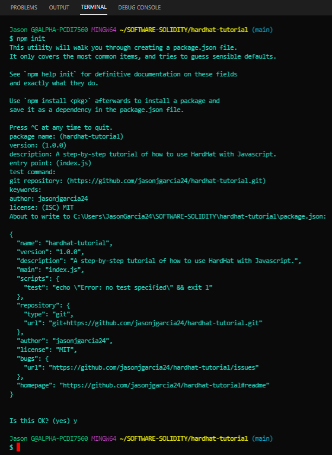
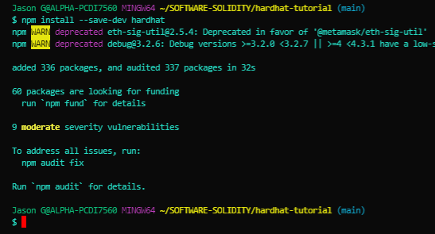
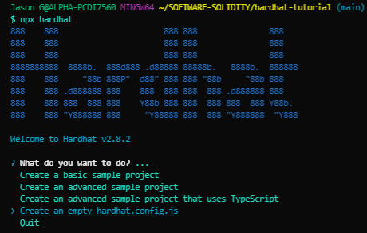

# Creating a New Hardhat Project<a id="Top-of-Page">
***
## Cotents<a id="Contents">
[Initialize NPM Project](#Initialize-NPM-Project)<br>

[Install Hardhat and Plugins](#Install-Hardhat-and-Plugins)<br>
 - [Hardhat Installation](#Hardhat-Installation)<br>
 - [Plugins Installation](#Plugins-Installation)<br>
    
[Add .gitignore](#Add-.gitignore)<br>
[Bottom of Page](#Bottom-of-Page)<br>

***
## Initialize NPM Project<a id="Initialize-NPM-Project">
- In the project folder, run the command <code>npm init</code>, or <code>npm init --yes</code> to use the npm project defaults.

<center></center><br>
This will then create the below file:<br>
```
    {
      "name": "hardhat-tutorial",
      "version": "1.0.0",
      "description": "A step-by-step tutorial of how to use HardHat with Javascript.",
      "main": "index.js",
      "scripts": {
        "test": "echo \"Error: no test specified\" && exit 1"
      },
      "repository": {
        "type": "git",
        "url": "git+https://github.com/jasonjgarcia24/hardhat-tutorial.git"
      },
      "author": "jasonjgarcia24",
      "license": "MIT",
      "bugs": {
        "url": "https://github.com/jasonjgarcia24/hardhat-tutorial/issues"
      },
      "homepage": "https://github.com/jasonjgarcia24/hardhat-tutorial#readme",
      "devDependencies": {
        "@nomiclabs/hardhat-ethers": "^2.0.4",
        "@nomiclabs/hardhat-waffle": "^2.0.1",
        "chai": "^4.3.4",
        "ethereum-waffle": "^3.4.0",
        "ethers": "^5.5.3",
        "hardhat": "^2.8.2"
      }
    }
```
***
## Install Hardhat and Plugins<a id="Install-Hardhat-and-Plugins">
### Hardhat Installation<a id="Hardhat-Installation">
- Install Hardhat with the command <code>npm install --save-dev hardhat</code>

    <center></center><br>
- Run the command <code>npx hardhat</code> and select <code>Create an empty hardhat.config.js</code>

<center></center><br>
This will create the following default Hardhat configuration file with the following contents:<br>
```js
    /**
     * @type import('hardhat/config').HardhatUserConfig
     */
    module.exports = {
      solidity: "0.7.3",
    };
```
### Plugins Installation<a id="Plugins-Installation">
<strong>Hardhat</strong> is unopinionated in terms of what tools you end up using, but it does come with some built-in defaults. All of which can be overridden. Most of the time the way to use a given tool is by consuming a plugin that integrate it into <strong>Hardhat</strong>.<br><br>
Here, we are going to use the <strong>Ethers.js</strong> and <strong>Waffle</stong> plugins. They'll allow us to interact with Ethereum and to test our contracts.<br><br>
- To install the noted plugins, run the command:<br><code>npm install --save-dev @nomiclabs/hardhat-ethers ethers @nomiclabs/hardhat-waffle ethereum-waffle chai</code>
- Then, add the line <code>require("@nomiclabs/hardhat-waffle");</code> to the top of your <code><a href="../hardhat.config.js" target="_blank">hardhat.config.js</a></code> so that it looks like this:<br>
```js
    require("@nomiclabs/hardhat-waffle");

    /**
     * @type import('hardhat/config').HardhatUserConfig
     */
    module.exports = {
      solidity: "0.7.3",
    };
```

<code>hardhat-waffle</code> depends on <code>hardhat-ethers</code>, so requiring <code>hardhat-waffle</code> is only necessary.
***
## Add .gitignore<a id="Add-.gitignore">
If the root path containing the above created Hardhat project is also a git repo, you should add a <code>.gitignore</code> file.<br>
- Use the following <code><a href="https://github.com/nomiclabs/hardhat/blob/master/.gitignore" target="_blank">.gitignore</a></code> as a base template.
***
[Top of Page](#Top-of-Page)<br>
[Contents](#Contents)<br>
[Initialize NPM Project](#Initialize-NPM-Project)<br>

[Install Hardhat and Plugins](#Install-Hardhat-and-Plugins)<br>
 - [Hardhat Installation](#Hardhat-Installation)<br>
 - [Plugins Installation](#Plugins-Installation)<br>
    
[Add .gitignore](#Add-.gitignore)<br>
<a id="Bottom-of-Page"></a>