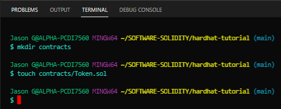
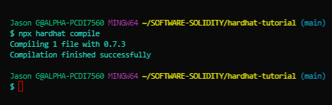

# Writing and Running Smart Contracts
******
## Cotents<a id="Contents">
[Write a Token Smart Contract](#Write-a-Token-Smart-Contract)<br>
[Compile the Smart Contract](#Compile-the-Smart-Contract)<br>
[Bottom of Page](#Bottom-of-Page)<br>

***
## Write a Token Smart Contract<a id="Write-a-Token-Smart-Contract">
- Create a new directory called <code>contracts</code> and create a file inside the directory called <code>Token.sol</code>

<br>
- Use the following solidity code:<br>
```solidity
    // SPDX-License-Identifier: MIT
    pragma solidity ^0.7.0;

    // This is the main building block for smart contracts.
    contract Token {
        // Some string type variables to identify the token.
        // The `public` modifier makes a variable readable from
        // outside the contract.
        string public name = "My Hardhat Token";
        string public symbol = "MHT";

        // The fixed amount of tokens stored in an unsigned integer type variable.
        uint256 public totalSupply = 1000000;

        // An address type variable is used to store ethereum accounts.
        address public owner;

        // A mapping is a key/value map. Here we store each account balance.
        mapping(address => uint256) balances;

        /**
         * Contract initialization.
         *
         * The `constructor` is executed only once when the contract is created.
         */
        constructor() {
            // The totalSupply is assigned to transaction sender,
            // which is the account
            // that deployed the contract.
            balances[msg.sender] = totalSupply;
            owner = msg.sender;
        }

        /**
         * A function to transfer tokens.
         *
         * The `external` modifier makes a function *only* callable from outside
         * the contract.
         */
        function transfer(address to, uint256 amount) external {
            // Chenck if the transaction sender has enough tokens.
            // If `require`'s first argument evaluates to `false` then the
            // transaction will revert.
            require(balances[msg.sender] >= amount, "Not enough tokens");

            // Transfer the amount.
            balances[msg.sender] -= amount;
            balances[to] += amount;
        }

        /**
         * Read only function to retrieve the token balance of a given account.
         *
         * The `view` modifier indicates that it doesn't modify the contract's
         * state, which allows us to call it without executing a transaction.
         */
        function balanceOf(address account) external view returns (uint256) {
            return balances[account];
        }
    }
```
***
## Compile the Smart Contract<a id="Compile-the-Smart-Contract">
- Compile the smart contract with <code>npx hardhat compile</code>

<br>
***
[Top of Page](#Top-of-Page)<br>
[Contents](#Contents)<br>
[Write a Token Smart Contract](#Write-a-Token-Smart-Contract)<br>
[Compile the Smart Contract](#Compile-the-Smart-Contract)<br>
<a id="Bottom-of-Page"></a>