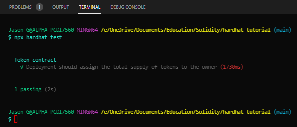
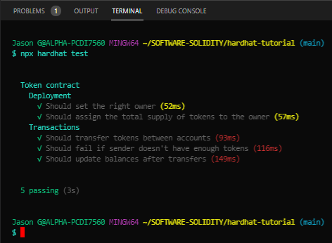

# Testing Smart Contracts with the Hardhat Network
Using the <strong>Hardhat Network</strong>, a local Ethereum network designed for development that is built-in and the default network in Hardhat, we can run automated tests. In these tests, we're going to use <strong>ethers.js</strong> to interact with the Ethereum contract we built in <a href="./01-Writing_and_Running_Smart_Contracts.md" target="_blank">01-Writing_and_Running_Smart_Contracts.md</a>'s <code><a href="../../contracts/Token.sol" target="_blank">Token.sol</a></code>, and <a href="https://mochajs.org/" target="_blank">Mocha</a> as our Javascript test framework runner for Node.js.
***
## Cotents<a id="Contents">
[Write a Token Smart Contract](#Write-a-Token-Smart-Contract)<br>
[Writing Basic Tests](#Writing-Basic-Tests)<br>
[Writing a Full Test](#Writing-a-Full-Test)<br>
[Appendix](#Appendix)<br>
[Bottom of Page](#Bottom-of-Page)<br>

***
## Writing Basic Tests<a id="Writing-Basic-Tests">
- Create a new directory called <code>test</code> inside our project root directory and create a new file called <code>Token.js</code>. Use the below code to start in <code>Token.js</code>:<br>
```js
    const { expect } = require("chai");

    describe("Token contract", function () {
        it("Deployment should assign the total supply of tokens to the owner", async function () {
            const owner = await ethers.getSigners();
            // console.log(owner[0])

            const Token = await ethers.getContractFactory("Token");

            const hardhatToken = await Token.deploy();

            const ownerBalance = await hardhatToken.balanceOf(owner[0].address);
            expect(await hardhatToken.totalSupply()).to.equal(ownerBalance);
        });
    })
```

- Running the command <code>npx hardhat test</code> should show the following output:
    
<center></center><br>
    
This means the test passed.
    
<b>Note</b>: If <code>console.log(owner[0])</code> was not commented out, the output would have included the [ethers.js Object](#ethers-js-Object):<br><br>
Now, let's dissect each line:<br>
```js
    const owner = await ethers.getSigners();</code>
```
A <code><a href="https://docs.ethers.io/v5/api/signer/" target="_blank">Signer</a></code> in ethers.js is an object that represents an Ethereum account. It's used to send transactions to contracts and other accounts. Here we're getting a list of the accounts in the node we're connected to, which in this case is the <strong>Hardhat Network</strong>. Altogether, we will get returned 20 signer account objects (<code>owner.length == 20</code>). An example of the ethers.js object can be seen [here](#ethers-js-Objec).<br><br>
The <code>ethers</code> variable is available in the global scope.
```js
    const Token = await ethers.getContractFactory("Token")
```
A <code>ContractFactory</code> in ethers.js is an abstraction used to deploy new smart contras, so <code>Token</code> here is  a factory for instances of our token contract.
```js
    const hardhatToken = await Token.deploy();
```
Calling <code>deploy()</code> on a <code>ContractFactory</code> will start the deployment, and return a <code>Promise</code> that resolves to a <code>Contract</code>. This is the object that has a method for each of your smart contract functions.
```js
    const ownerBalance = await hardhatToken.balanceOf(owner[0].address);
```
Once the contract is deployed, we can call our contract methos on <code>hardhatToken</code> and use them to get the balance of the owner account by calling <code>balanceOf()</code>.<br><br>
Remeber that the owner of the token who gets the entire supply is the account that makes the deployment, and when using the <code>hardhat-ethers</code> plugin <code>ContractFactory</code> and <code>Contract</code> instances are connected to the first signer by default. This means that the account in the <code>owner</code> variable executed the deployment, and <code>balanceOf()</code> should return the entire supply amount.
```js
    expect(await hardhatToken.totalSupply()).to.equal(ownerBalance);
```
Here we're again using our <code>Contract</code> instance to call a smart contract function in our Solidity code. <code>totalSupply()</code> returns the token's supply amount and we're checking that it's equal to <code>ownerBalance</code>, as it should.<br><br>
To do this we're using <a href="https://www.chaijs.com/" target="_blank">Chai</a> which is an assertions library. These asserting functions are called "matchers", and the ones we're using here actually come from <a href="https://getwaffle.io/" target="_blank">Waffle</a>. This is why we're using the <code>hardhat-waffle</code> plugin, which makes it easier to assert values from Ethereum.<br><br>
The entire list of Ethereum-specific matchers can be found <a href="https://ethereum-waffle.readthedocs.io/en/latest/matchers.html" target="_blank">in this setion</a> in Waffle's documentation.
***
## Writing a Full Test<a id="Writing-a-Full-Test">
Below is a full test suite for the token with additional information about Mocha and how to structure your tests.
```js
    // We import Chai to use its asserting functions here.
    const { expect } = require("chai");
    
    // `describe` is a Mocha function that allows you to organize your tests. It's
    // not actually needed, but having your tests organized makes debugging them
    // easier. All Mocha functions are available in the global scope.
    
    // `describe` receives the name of a section of your test suite, and a callback.
    // The callback must define the tests of that section. This callback can't be
    // an async function.
    describe("Token contract", function () {
        // Mocha has four functions that let you hook into the test runner's
        // lifecycle. These are: `before`, `beforeEach`, `after`, `afterEach`.
    
        // They're very useful to setup the environment for tests, and to clean it
        // up after they run.
    
        // A common pattern is to declare some variables, and assigne them in the
        // `before` and `beforeEach` callbacks.
    
        let Token;
        let hardhatToken;
        let owner;
        let addr1;
        let addr2;
        let addrs;
    
        // `beforeEach` will run before each test, re-deploying the contract every
        // time. It receives a callback, which can be async.
        beforeEach(async function () {
            // Get the ContractFactory and Signers here.
            Token = await ethers.getContractFactory("Token");
            [owner, addr1, addr2, ...addrs] = await ethers.getSigners();
    
            // To deploy our contract, we just havae to call Token.deploy() and await
            // for it to be deployed(), which happens once its transaction has been
            // minded.
            hardhatToken = await Token.deploy();
        });
        
        // You can nest describe calls to create subsections.
        describe("Deployment", function () {
            // `it` is another Mocha function. This is the one you use to define your
            // tests. It receives the test name, and a callback function.
            
            // If the callback function is async, Mocha will `await` it.
            it("Should set the right owner", async function () {
                // Expect receives a value, and wraps it in an Assertion object. These
                // objects have a lot of utility methods to assert values.
    
                // This test expects the owner variable stored in the contract to be equal
                // to our Signer's owner.
                expect(await hardhatToken.owner()).to.equal(owner.address);
            });
    
            it("Should assign the total supply of tokens to the owner", async function () {
                const ownerBalance = await hardhatToken.balanceOf(owner.address);
                expect(await hardhatToken.totalSupply()).to.equal(ownerBalance);
            });
        });
    
        describe("Transactions", function () {
            it("Should transfer tokens between accounts", async function () {
                // Transfer 50 tokens from owner to addr1
                await hardhatToken.transfer(addr1.address, 50);
                const addr1Balance = await hardhatToken.balanceOf(addr1.address);
                expect(addr1Balance).to.equal(50);
    
                // Transfer 50 tokens from addr1 to addr2
                // We use .connect(signer) to send a transaction from another account
                await hardhatToken.connect(addr1).transfer(addr2.address, 50);
            });
    
            it("Should fail if sender doesn't have enough tokens", async function () {
                const initialOwnerBalance = await hardhatToken.balanceOf(owner.address);
    
                // Try to send 1 token from addr1 (0 tokens) to owner (1000000 tokens).
                // `require` will evaluate false and revert the transaction.
                // Note: the reverted string of "Not enough tokens" what is in the Token.sol
                // require statement under transfer().
                await expect(
                    hardhatToken.connect(addr1).transfer(owner.address, 1)
                ).to.be.revertedWith("Not enough tokens");
    
                // Owner balance shouldn't have changed.
                expect(await hardhatToken.balanceOf(owner.address)).to.equal(
                    initialOwnerBalance
                );
            });
    
            it("Should update balances after transfers", async function () {
                const initialOwnerBalance = await hardhatToken.balanceOf(owner.address);
    
                // Transfer 100 tokens from owner to addr1.
                await hardhatToken.transfer(addr1.address, 100);
                
                // Transfer another 50 tokens from owner to addr2.
                await hardhatToken.transfer(addr2.address, 50);
    
                // Check balances.
                const finalOwnerBalance = await hardhatToken.balanceOf(owner.address);
                expect(finalOwnerBalance).to.equal(initialOwnerBalance - 150);
    
                const addr1Balance = await hardhatToken.balanceOf(addr1.address);
                expect(addr1Balance).to.equal(100);
    
                const addr2Balance = await hardhatToken.balanceOf(addr2.address);
                expect(addr2Balance).to.equal(50);
            });
        });
    });
```
The output of <code>npx hardhat test</code> will look like the following:<br>
<center></center>

***
## Appendix<a id="Appendix">
#### ethers.js Object<a id="ethers-js-Object">
```
    SignerWithAddress {
      _isSigner: true,
      address: '0xf39Fd6e51aad88F6F4ce6aB8827279cffFb92266',
      _signer: JsonRpcSigner {
        _isSigner: true,
        provider: EthersProviderWrapper {
          _isProvider: true,
          _events: [],
          _emitted: [Object],
          formatter: [Formatter],
          anyNetwork: false,
          _networkPromise: [Promise],
          _maxInternalBlockNumber: -1024,
          _lastBlockNumber: -2,
          _pollingInterval: 4000,
          _fastQueryDate: 0,
          connection: [Object],
          _nextId: 42,
          _hardhatProvider: BackwardsCompatibilityProviderAdapter {
            _wrapped: FixedGasProvider {
              _wrapped: AutomaticSenderProvider {
                _wrapped: [HardhatNetworkProvider],
                _wrappedProvider: [HardhatNetworkProvider]
              },
              _wrappedProvider: AutomaticSenderProvider {
                _wrapped: [HardhatNetworkProvider],
                _wrappedProvider: [HardhatNetworkProvider]
              },
              _gasLimit: 30000000
            },
            _provider: FixedGasProvider {
              _wrapped: AutomaticSenderProvider {
                _wrapped: [HardhatNetworkProvider],
                _wrappedProvider: [HardhatNetworkProvider]
              },
              _wrappedProvider: AutomaticSenderProvider {
                _wrapped: [HardhatNetworkProvider],
                _wrappedProvider: [HardhatNetworkProvider]
              },
              _gasLimit: 30000000
            },
            sendAsync: [Function: bound sendAsync],
            send: [Function: bound send],
            _sendJsonRpcRequest: [Function: bound _sendJsonRpcRequest] AsyncFunction
          },
          _eventLoopCache: [Object],
          _network: [Object]
        },
        _address: '0xf39Fd6e51aad88F6F4ce6aB8827279cffFb92266',
        _index: null
      },
      provider: EthersProviderWrapper {
        _isProvider: true,
        _events: [],
        _emitted: { block: -2 },
        formatter: Formatter { formats: [Object] },
        anyNetwork: false,
        _networkPromise: Promise { [Object] },
        _maxInternalBlockNumber: -1024,
        _lastBlockNumber: -2,
        _pollingInterval: 4000,
        _fastQueryDate: 0,
        connection: { url: 'http://localhost:8545' },
        _nextId: 42,
        _hardhatProvider: BackwardsCompatibilityProviderAdapter {
          _wrapped: FixedGasProvider {
            _wrapped: AutomaticSenderProvider {
              _wrapped: [HardhatNetworkProvider],
              _wrappedProvider: [HardhatNetworkProvider]
            },
            _wrappedProvider: AutomaticSenderProvider {
              _wrapped: [HardhatNetworkProvider],
              _wrappedProvider: [HardhatNetworkProvider]
            },
            _gasLimit: 30000000
          },
          _provider: FixedGasProvider {
            _wrapped: AutomaticSenderProvider {
              _wrapped: [HardhatNetworkProvider],
              _wrappedProvider: [HardhatNetworkProvider]
            },
            _wrappedProvider: AutomaticSenderProvider {
              _wrapped: [HardhatNetworkProvider],
              _wrappedProvider: [HardhatNetworkProvider]
            },
            _gasLimit: 30000000
          },
          sendAsync: [Function: bound sendAsync],
          send: [Function: bound send],
          _sendJsonRpcRequest: [Function: bound _sendJsonRpcRequest] AsyncFunction
        },
        _eventLoopCache: { detectNetwork: null },
        _network: { chainId: 31337, name: 'unknown' }
      }
    }
```

***
[Top of Page](#Top-of-Page)<br>
[Contents](#Contents)<br>
[Write a Token Smart Contract](#Write-a-Token-Smart-Contract)<br>
[Writing Basic Tests](#Writing-Basic-Tests)<br>
[Writing a Full Test](#Writing-a-Full-Test)<br>
[Appendix](#Appendix)    