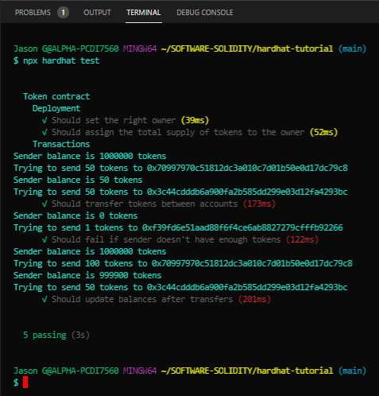

# Debugging with Hardhat Network<a id="Top-of-Page">
<strong>Hardhat</strong> comes built-in with <strong>Hardhat Network</strong>, a local Ethereum network designed for development. It allows you to deploy your contracts, run your tests and debug your code. It's the default network <strong>Hardhat</strong> connects to, so you don't need to setup anything for it to work.
***
## Cotents<a id="Contents">
[Solidity <code>console.log</code>](#Solidity-console-log)<br>
[Bottom of Page](#Bottom-of-Page)<br>
***
## Solidity <code>console.log</code><a id="Solidity-console-log">
When running your contracts and tests on <strong>Hardhat Network</strong> you can print logging messages and contract variables calling <code>console.log()</code> from your Solidity code. To use it you have to import <strong>Hardhat</strong>'s <code>console.log</code> from your contract code.<br><br>
This is what it should look like:<br>
```solidity
    pragma solidity ^0.7.0;
    
    import "hardhat/console.sol";
    
    contract Token {
    // ...
    }
```
Add some <code>console.log</code> to the <code>transfer()</code> function as you were using it in Javascript:<br>
```solidity
    function transfer(address to, uint256 amount) external {
        console.log("Sender balance is %s tokens", balances[msg.sender]);
        console.log("Trying to send %s tokens to %s", amount, to);
    
        require(balances[msg.sender] >= amount, "Not enough tokens");
    
        balances[msg.sender] -= amount;
        balances[to] += amount;
    }
```
The logging output will show when you run your tests:

<center></center>
***

[Top of Page](#Top-of-Page)<br>
[Contents](#Contents)<br>
[Solidity <code>console.log</code>](#Solidity-console-log)<br>
<a id="Bottom-of-Page">